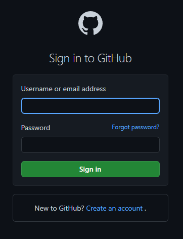
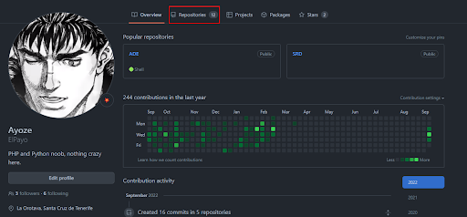
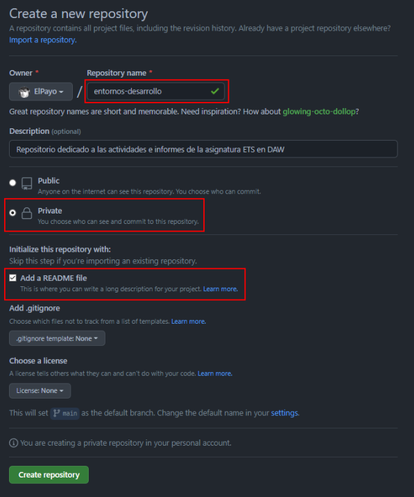
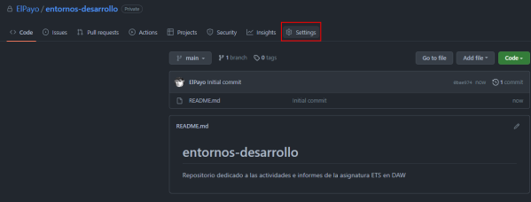
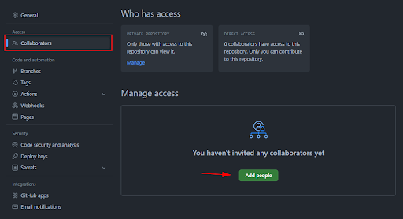

## ETS

**Nombre:** Ayoze Hernández Díaz.

**Curso:** 1º Desarrollo de Aplicaciones Web.

**Asignatura:** Entornos de desarrollo.

### ÍNDICE

+ [Acceso a la cuenta](#id1)
+ [Creación de repositorio](#id2)
+ [Añadir colaboradores](#id3)
+ [Complicaciones](#id4)

### Acceso a la cuenta 

Debido a que venía de ASIR y se utilizaba **Github** para algunas asignaturas ya tengo cuenta creada por lo que enseñaré el método de acceso a esta misma.

En la esquina superior derecha de la página de **Github** nos aparecerá una barra de búsqueda, y dos enlaces, uno para iniciar sesión y otro para registrarse, se hace clic en iniciar sesión.

Una vez hayamos hecho clic, aparece la siguiente pantalla en la que pondremos nuestros datos de acceso.

### Creación de repositorio 

Una vez dentro ya podemos proceder a crear repositorios. Una vez nos situemos en esta página se debe acceder al apartado ***Repositories*** señalado.

Una vez ahí dentro, en la esquina superior derecha hay un botón verde que tiene escrito NEW, hacemos clic en el y procedemos a crear un nuevo repositorio de **Github**.
	Este repositorio tendrá unos parámetros específicos:

+ El repositorio será privado.
+ El repositorio deberá tener un fichero README.md inicial.
+ El repositorio deberá ser compartido como colaborador al profe (usuario del profe: @jpexposito + en **Github**).
+ El nombre del repositorio será entornos-desarrollo.

Hay un apartado opcional que es la descripción, yo rellené este apartado, lo que terminará siendo el contenido inicial del README.md que se añadió

### Añadir colaboradores 

Una vez creado el repositorio se puede proceder a compartir el repositorio con el profesor, para ello hay que situarse en la página del repositorio y acceder a los ajustes del mismo.

Luego en el panel de ajustes del lateral izquierdo, en la pestaña de colaboradores podemos añadir uno en el botón verde que pone ***Add people***.

Una vez ahí, buscamos el usuario de nuestro profesor y lo añadimos como colaborador de nuestro repositorio

### Complicaciones 

La verdad es que no hubo ningún tipo de complicaciones
