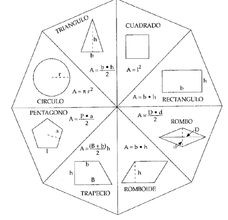

## ETS <a name=id0></a>

**Nombre:** Ayoze Hernández Díaz.

**Curso:** 1º Desarrollo de Aplicaciones Web.

**Asignatura:** Entornos de desarrollo.

### ÍNDICE

+ [ETS](#id0)
+ [1. Descripción del problema](#id1)
+ [2. Tipos de figuras y sus fórmulas](#id2)
+ [2.1 Identificación de elementos similares en las fórmulas](#id2-1)
+ [3. Introducción y comprobación de los datos](#id3)
+ [Anexo](#id4)

### 1. Descripción del problema <a name=id1></a>

Se pide la realización de una aplicación que pueda resolver el area de 8 tipos de figuras geométricas diferentes. La aplicación debe de permitirle al usuario elegir que forma quiere calcular y además debe permitirle introducir los datos manualmente para que los calculos a realizar sean acordes a las necesidades del usuario.

### 2. Tipos de figuras y sus fórmulas <a name=id2></a>

Las figuras entre las que el usuario podrá elegir son las mostradas en la siguiente imagen:



Ahora se describirán las fórmulas de las figuras anteriormente vistas:

+ **Cuadrado:** ***l<sup>2*** 

+ **Rectángulo:** ***la * lb***

+ **Rombo:** ***(D · d) / 2*** 

+ **Romboide:** ***b · h*** 

+ **Trapecio:** ***((B + b) · h) / 2***

+ **Pentágono:** ***(P · a) / 2***

+ **Circulo:** ***&pi; · r<sup>2***

+ **Triángulo:** ***(b · h) / 2***

#### 2.1 Identificación de elementos similares en las fórmulas <a name=id2-1></a>

En las fórmulas de las figuras anteriormente descritas se pueden encontrar similitudes en las fórmulas por lo que lo más logico sería agrupar esos casos en el codigo de la aplicación para que al hacer mantenimiento sea más fácil añadir o cambiar elementos, a continuación se verán las similitudes entre las fórmulas:

+ La fórmula del cuadrado y del rectángulo se basan en multiplicar lado por lado, por lo que esa fórmula serviría para los 2 casos. 

+ En la fórmula del triangulo ((b * h) / 2) la parte superior de la división, es decir la base por la altura es un elemento común en el romboide.

### 3. Introducción y comprobación de datos introducidos <a name="id3"></a>

Después de que el usuario haya introducido manualmente la figura de la que desea hallar el area el programa deberá mostrar una pantalla en la que le permita introducir los datos de la figura indicando que parametros corresponderán a que parte de la figura, se muestra un ejemplo en texto a continuación:

```
Figura elegida: Pentágono

Apotema: 5 cm

Lado: 6 cm

```

Además de esto se mostrará una pantalla de comprobación de datos en la que se asegure que el usuario haya introducido los datos correctos, se muestra ahora una demostración en texto siguiendo el ejemplo anterior:

```
¿Desea cambiar las medidas o continuar con las medidas introducidas? Apotema = 5 cm; lado = 6 cm

```

Para que los calculos realizados tengan resultados lógicos se tendrán en cuenta un par de puntos.

1. El resultado no puede ser 0 ya que es un area lo que estamos calculando, por lo que devolverá un error indicando donde está el fallo.

2. El resultado no puede ser negativo ya que no hay areas negativas, por lo que devolverá un error indicando donde está el fallo.

3. Se usará el sistema métrico decimal, por lo que la unidad para los datos introducidos se pedirán en metros y se devolverá el resultado en m<sup>2</sup>.

Teniendo las reglas anteriores en cuenta ahora el resultado de la operación deberá ser mostrado por pantalla al usuario.


### 4. Anexo <a name=id5></a>

```
Leyenda:

l = Lado
la = Lado a
lb = Lado b
B = Base grande
b = Base chiquita
h = Altura (height)
P = Perímetro
r = Radio
D = Diagonal mayor
d = Diagonal menor
a = Apotema

```