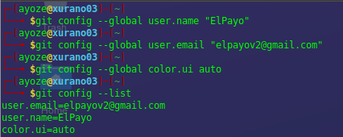
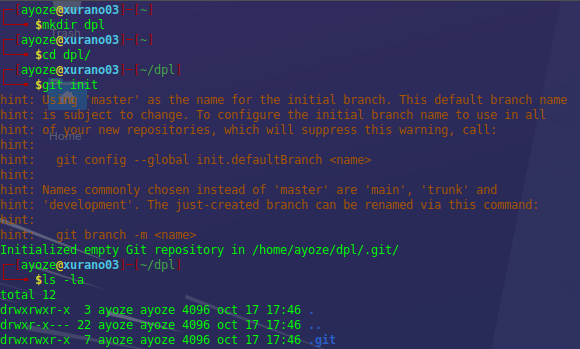
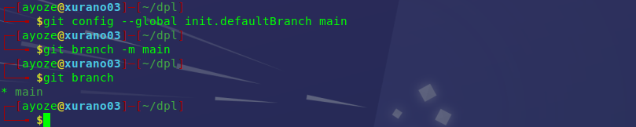
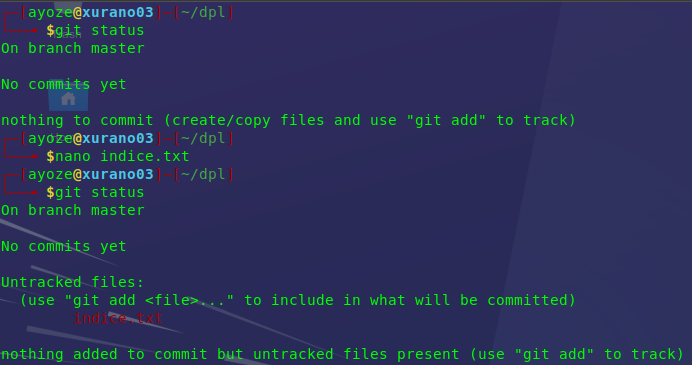
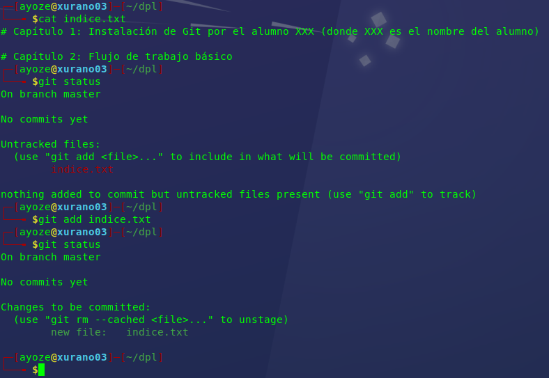
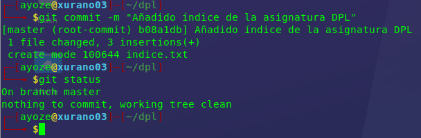
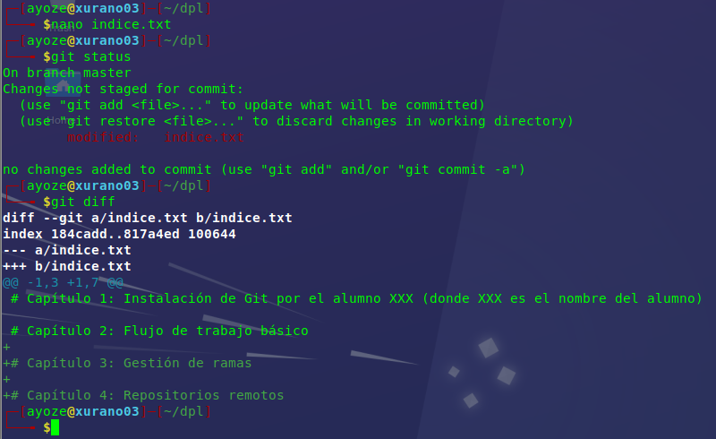
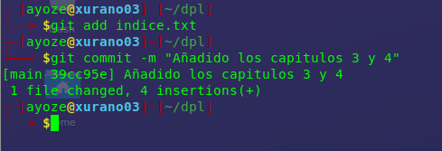
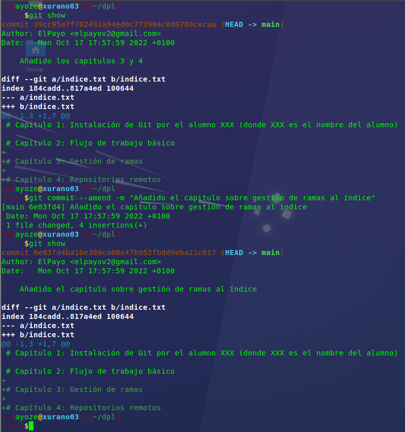

## Manipulación de repositorios en Git 

**Nombre:** Ayoze Hernández Díaz.

**Curso:** 1º Desarrollo de Aplicaciones Web.

**Asignatura:** Entornos de desarrollo.

### ÍNDICE

+ [Manipulación de repositorios en Git](#id0)
+ 
+ 
+ 
+ 
+ 
+ 
+ 
+ 

### Introducción 

Esta tarea tiene como objetivo que el alumno, es decir el autor de este README, se familiarice tanto con la creación como manipulación de repositorios en GIT.

## Tareas 

### Tarea: Configuración 

Antes de empezar con el resto de las tareas, lo principal es configurar quienes somos.

### Tarea: Creación de un repositorio 

Creamos la carpeta contenedora del repositorio y ejecutamos git init.

Nos sale una advertencia que nos suguiere que escojamos el nombre que queremos usar para nuestra rama principal, nos da las opciones de **main** o **master** como recomendaciones principales, en este caso escogemos main y la establecemos como rama por defecto.

### Tarea: Comprobar el restado del repositorio 

Ahora toca comprobar el estado del repositorio y hacer cambios a este mismo. Para esto comprobaremos primeramente el estado del repositorio; acto seguido se crea el fichero indice.txt y añadimos los 2 primeros capítulos y se vuelve a comprobar el estado del repositorio con **git status**.

### Tarea: Realizando Commit's 

Para poder realizar un **commit** crearemos un archivo indice.txt y le añadiremos contenido. Luego volveremos a comprobar el estado del repositorio y guardaremos los cambios mediante **git add**  y **git commit -m**.

### Tarea: Modificación de ficheros 

Modificamos el fichero indice.txt y añadimos los 2 últimos capítulos. Después de esto miraremos las diferencias entre el indice.txt de antes y el de ahora con **git diff**.

Añadimos los cambios con **git add** y **git commit -m**.

### Tarea: Historial 

Ahora tendremos que ver el historico de todos los cambios que se han realizado en este repositorio. Para ello usamos **git show** y **git amend**

