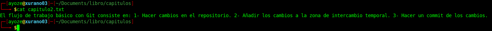
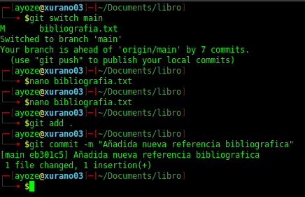
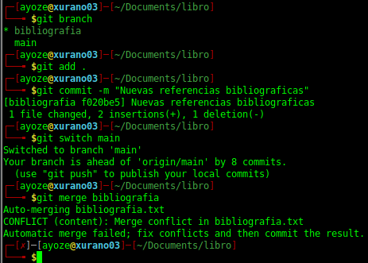
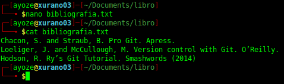
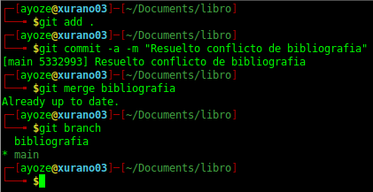
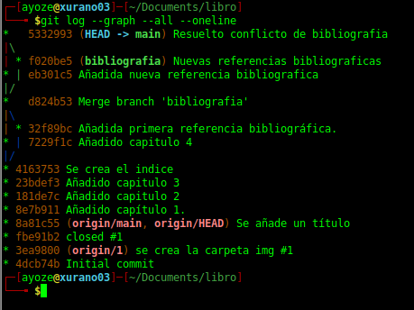

## Manipulación avanzada de repositorios en Git 

**Nombre:** Ayoze Hernández Díaz.

**Curso:** 1º Desarrollo de Aplicaciones Web.

**Asignatura:** Entornos de desarrollo.

### ÍNDICE

+ [Manipulación avanzada de repositorios en Git](#id0)
+ [Tareas](#id1)
  + [Ejercicio 1](#id2)
  + [Ejercicio 2](#id3)
  + [Ejercicio 3](#id4)
  + [Ejercicio 4](#id5)
  + [Ejercicio 5](#id6)
  + [Ejercicio 6](#id7)
  + [Ejercicio 7](#id8)
  + [Ejercicio 8](#id9)
  + [Ejercicio 9](#id10)
+ [ANEXO](#ANEXO)
### Tareas 

Siguiendo el fichero de **[EJEMPLOS](https://github.com/jpexposito/docencia/blob/master/COMUN/GIT/ejemplos/EJEMPLOS.md)** se deben de realizar 9 ejercicios, para ello necesitaremos tener clonado el repositorio de **[LIBRO](https://github.com/jpexposito/libro.git)** que el profesor proporciona en la página de **EJEMPLOS**.

### Ejercicio 1 

En el primer ejercicio se usaran los comandos **git log**, **git add** y **git commit** (Al final de la página, en el [ANEXO](#ANEXO) se explica que hace cada comando de los que han sido usados en esta práctica). 

### Ejercicio 2 

Añadimos el archivo capitulo2 con el contenido indicado en la imagen siguiente: 

Ahora vemos las diferencias entre la ultima versión y 2 anteriores, para ello, como en el ejercicio 1 ejecutaremos los comandos **git add** y **git commit -m** "Añadido capitulo 2".

### Ejercicio 3 

Realizamos los mismos pasos que en el ejercicio 1, es decir, crear el fichero 3, hacer **git add** y **git commit** para guardar los cambios realizados, y después de esto se procede a mirar las diferencias entre el último commit que se haya realizado y la primera versión del repositorio.

### Ejercicio 4 

Añadimos un fichero indice por fuera de la carpeta capitulos y le añadimos contenido. Se comprueba el estado de los ficheros con **git status** y añadimos los cambios con **git add** y **git commit**

Comprobamos quién fue el último en modificar el fichero con **git annotate**.

### Ejercicio 5 

Se crea la rama bibliografía con **git branch bibliografia**. 

### Ejercicio 6 

Creamos el fichero capitulo y le añadimos el contenido correspondiente.

Vemos de manera ordenada y gráfica los commits realizados.

### Ejercicio 7 

Nos cambiamos a la rama de bibliografia y creamos el fichero bibliografia correspondiente y le añadimos contenido.

Guardamos los cambios.

### Ejercicio 8 

Realizamos un merge de la rama bibliografia desde la rama main.

Eliminamos la rama bibliografia con **git branch -d**. Y vemos los cambios. 

### Ejercicio 9 

Creamos la rama bibliografia de nuevo

Nos cambiamos a la rama bibliografia y creamos un fichero bibliografia con contenido.

Nos cambiamos a la rama main de nuevo y creamos el mismo fichero pero con contenido diferente y guardamos con **git add** y **git commit** en las 2 ramas e intentamos realizar un **merge**.

Como nos da error el **merge** debemos de cambiar el contenido del fichero bibliografia.txt para que contenga las lineas de ambos ficheros.

Con un **git commit -a -m** reemplazamos el último commit que se haya realizado y así arreglamos el conficto.

Mostramos un historico de los cambios.

----

## ANEXO 

+ git add: Añade los nuevos ficheros y cambios realizados al commit
+ git commit -m "Mensaje de ejemplo": Guarda los cambios realizados con un mensaje descriptivo
+ git commit -a: Añade automaticamente los ficheros que hayan sido modificados o borrados sin afectar a los nuevos ficheros que hayan sido creado desde el ultimo push
+ git branch *Nombre de rama nueva*: Crea una rama nueva en el proyecto en el que estemos trabajando.
  + git branch -d: Borra la rama del nombre indicado.
+ git switch o git checkout *Nombre de la rama a la que se desea desplazar*: Cambia entre ramas en el proyecto.
+ git log: Muestra un historico de los commits que han sido realizados.
  + git log --graph --all --oneline: Muestra todos los cambios realizados con una representación gráfica de las ramas en el lado izquierdo del output y los muestra de manera ordenada
+ git diff: Muestra las diferencias entre 2 commits/merges/archivos o versiones de algo en el repositorio.
+ git annotate: Sirve para ver cada una de las lineas que han sido modificadas en un archivo, viendo además quién es el autor de esas modificaciones.
+ git merge *Nombre del repositorio*: Compara los archivos que contienen 2 ramas y las intenta fusionar.
