## Manipulación avanzada de repositorios en Git 

**Nombre:** Ayoze Hernández Díaz.

**Curso:** 1º Desarrollo de Aplicaciones Web.

**Asignatura:** Entornos de desarrollo.

### ÍNDICE

+ [ETS](#id0)
+ [Tareas](#id1)
  + [Ejercicio 1](#id2)
  + [Ejercicio 2](#id3)
  + [Ejercicio 3](#id4)
  + [Ejercicio 4](#id5)
  + [Ejercicio 5](#id6)
  + [Ejercicio 6](#id7)
  + [Ejercicio 7](#id8)
  + [Ejercicio 8](#id9)
  + [Ejercicio 9](#id10)
+ [ANEXO](#ANEXO)
### Tareas 

Siguiendo el fichero de **[EJEMPLOS](https://github.com/jpexposito/docencia/blob/master/COMUN/GIT/ejemplos/EJEMPLOS.md)** se deben de realizar 9 ejercicios, para ello necesitaremos tener clonado el repositorio de **[LIBRO](https://github.com/jpexposito/libro.git)** que el profesor proporciona en la página de **EJEMPLOS**.

### Ejercicio 1 

EN el primer ejercicio se usaran los comandos **git log**, **git add** y **git commit** (Al final de la página, en el [ANEXO](#ANEXO) se explica que hace cada comando de los que han sido usados en esta práctica). 

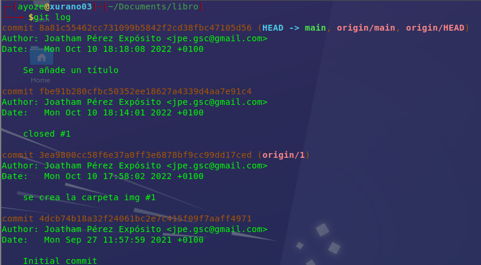

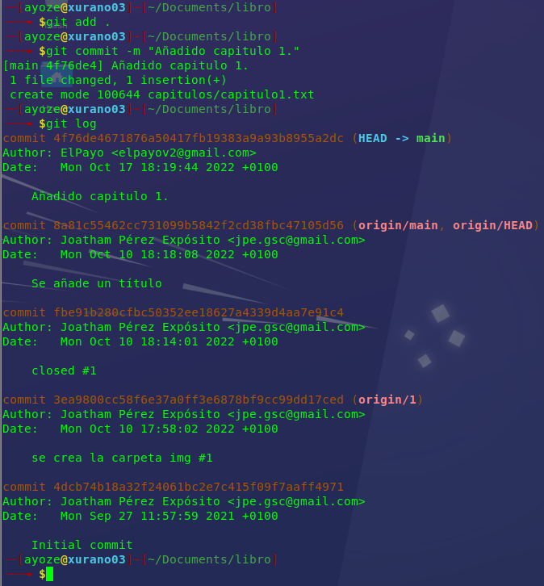

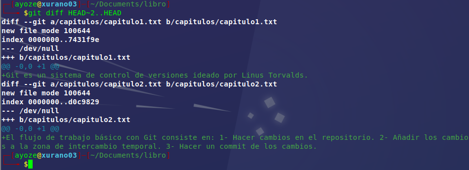

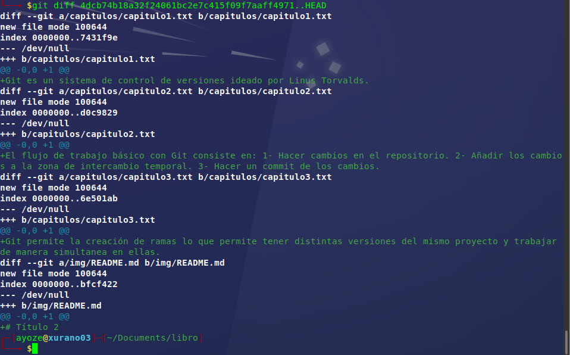

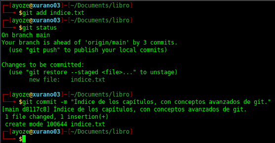

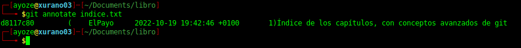

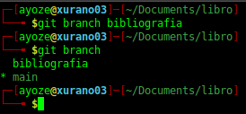

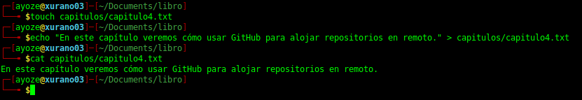

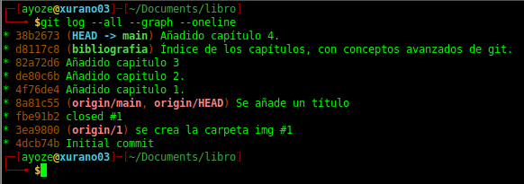

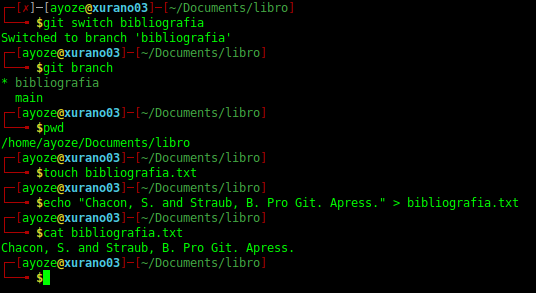

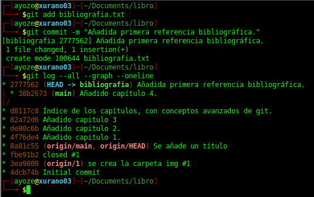

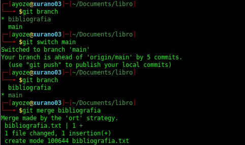

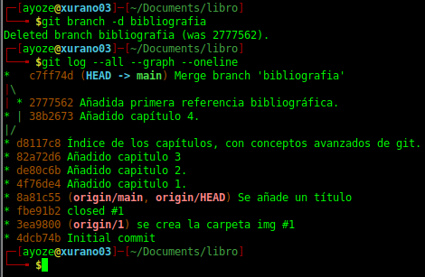

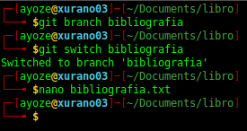

### Ejercicio 2 

### Ejercicio 3 

### Ejercicio 4 

### Ejercicio 5 

### Ejercicio 6 

### Ejercicio 7 

### Ejercicio 8 

### Ejercicio 9 

## ANEXO 