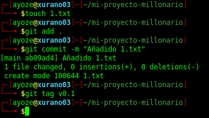
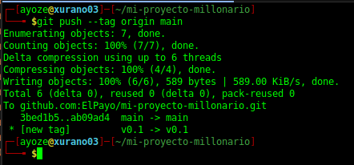
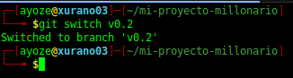
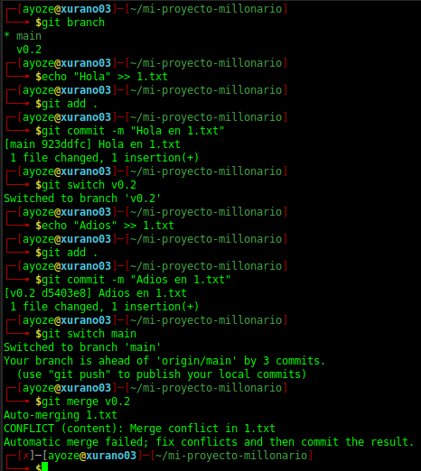

## Manipulación Avanzada en Git trabajo con tags y ramas. 

**Nombre:** Ayoze Hernández Díaz.

**Curso:** 1º Desarrollo de Aplicaciones Web.

**Asignatura:** Entornos de desarrollo.

### ÍNDICE

+ [Manipulación Avanzada en Git trabajo con tags y ramas.](#id0)
+ [Tareas](#id1)
  + [Tarea 1: Creación del repositorio y Readme inicial](#id2)
  + [Tarea 2 y 3: Commit y push inicial](#id3)
  + [Tarea 4: Ignorar archivos](#id4)
  + [Tarea 5, 6 y 7: Añadir fichero 1, creación del tag v0.1 y subida del mismo](#id5)
  + [Tarea 8: Crear una rama v0.2](#i6)
  + [Tarea 9: Añadir fichero 2](#id7)
  + [Tarea 10: Crear rama remota](#id8)
  + [Tarea 11: Merge directo](#id9)
  + [Tarea 12: Merge con conflicto](#id10)
  + [Tarea 13: Listado de cambios](#id11)
 + [ANEXO](#ANEXO)

### Tareas 

## Tarea 1: Creación del repositorio y Readme inicial 

Creamos el repositorio de nuestro ***Proyecto Millonario*** en Github y nos lo bajamos con git clone.

Ahora editamos el fichero [README](https://github.com/ElPayo/mi-proyecto-millonario#readme) y vamos añadiendo las preguntas realizadas por el profesor en su documento de explicación, además de añadir los comandos que se hayan usado durante la practica, por ahora se añade lo siguiente.

## Tarea 2 y 3: Commit incial 

Ahora guardamos los cambios con git add y git commit. Acto seguido realizaremos tanto el push como el commit iniciales.

## Tarea 4: Ignorar archivos 

Ahora debemos crear el fichero .gitignore en el que especificaremos los archivos y carpetas que no queremos que se suban al repositorio en la nube, en nuestro caso no queremos que se suban **privado.txt** ni **privada/**

Vemos una estructura de como tenemos el repositorio actualmente.

Ahora guardamos los cambios que se han realizado

## Tarea 5, 6 y 7: Añadir fichero 1, creación del tag v0.1 y subida del mismo 

Ahora añadimos el fichero 1.txt que se usará para similar la primera versión del repositorio.

Guardamos los cambios como se muestra arriba y hacemos que el tag ahora esté en la nube con **git push --tag origin main**.

## Tarea 8: Crear una rama v0.2 

Ahora creamos la rama v0.2.

## Tarea 9: Añadir fichero 2 

Nos cambiamos a la rama v0.2 y creamos el fichero 2.txt.

## Tarea 10: Crear rama remota 

Creamos la rama remotamente con **git push origin v0.2**.

## Tarea 11: Merge directo 

Ahora podemos mezclar el contenido de las 2 ramas sin que haya conflicto alguno.

## Tarea 12: Merge con conflicto 

Ahora vamos a hacer un merge para que de conflicto. Para ello debemos modificar el fichero **1.txt** tanto en la rama **v0.2** como en **main**, en las 2 ramas va a tener contenido diferente para que surja el conflicto.

Aquí vemos el resultado de realizar lo explicado anteriormente.

Ahora para arreglar los conflictos debemos modificar el fichero **1.txt** para que contenga tanto el contenido del fichero **1.txt** de **main** como el contenido del fichero **1.txt** de **v0.2**.

Ahora creamos el tag v0.2 y eliminamos la rama v0.2.

## Tarea 13: Listado de cambios 

Ahora podemos ver un listado de los cambios realizados en el repositorio.

----

## ANEXO : 

Comandos de git usados:

+ **git add**: Se usa para guardar los cambios en los ficheros que se indiquen.
+ **git commit**: Se usa para poner un comentario a todos los ficheros que hayan sido guardados con git add.
+ **git push**: Se usa para llevar los cambios que hayan sido guardados a la nube.
+ **git branch**: Se usa para el manejo de ramas.
+ **git switch**: Se usa para cambiar entre ramas.
+ **git tag**: Se usa para marcar el punto historico de en el que 2 versiones se separan
+ **git merge**: Se usa para mezclar el contenido de 2 ramas en git.
