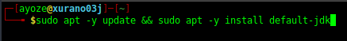
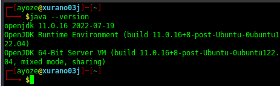
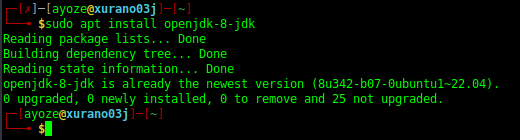
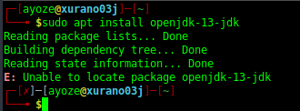
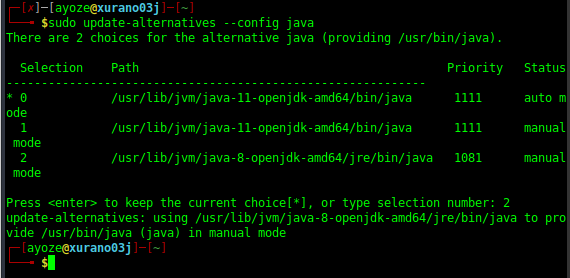
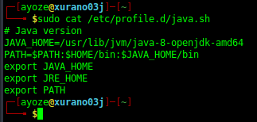

## Instalación de Java 

**Nombre:** Ayoze Hernández Díaz.

**Curso:** 1º Desarrollo de Aplicaciones Web.

**Asignatura:** Entornos de desarrollo.

### ÍNDICE

+ [Instalación de Java](#id0)
+ [Actualización de la máquina e instalación](#id1)
+ [Instalación de versiones específicas](#id2)
+ [Configuración de variables de entorno](#id3)

### Actualización de la máquina e instalación 

Actualizamos la maquina con **apt update** e instalamos java con **apt install default-jdk**.

Comprobamos que versión se ha instalado.

### Instalación de versiones específicas 

Teniendo la versión comprobada, instalamos otra versión, en mi caso la versión 8.

---

Para que quede constancia de ello, se intentó instalar la versión 13 de java, cosa que no pudo ser debido a que la distribución del sistema operativo de mi maquina (xubuntu 22) no da soporte a la misma.

---
### Configuración de variables de entorno 

Ahora procedemos a configurar las variables de entornos necesarias para java.

Para ello hay 2 maneras, la primera es con **update-alternatives**.

La segunda se hace mediante la creación de un fichero bash en el que se le adjudica un **PATH** y un **HOME** a Java.

