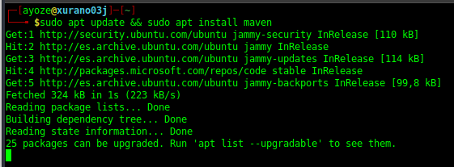
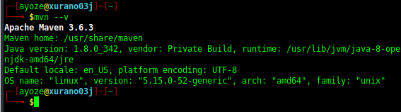
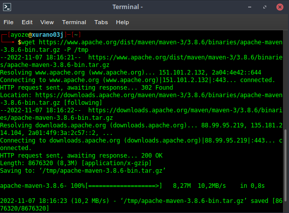
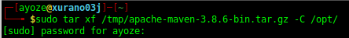
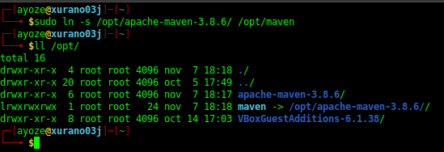
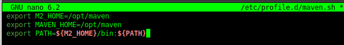
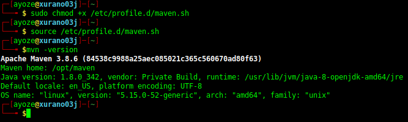

## Instalación de Maven 

**Nombre:** [Ayoze Hernández Díaz.](https://github.com/ElPayo)

**Curso:** 1º Desarrollo de Aplicaciones Web.

**Asignatura:** Entornos de desarrollo.

### ÍNDICE

+ [Instalación de Maven](#id0)
+ [Instalación de maven en la máquina](#id1)
+ [Instalación de una versión especifica](#id2)

### Instalación de maven en la máquina 

Instalamos maven y actualizamos el estado de los paquetes de la máquina.

Comprobamos que se ha instalado y vemos la versión instalada.

### Instalación de una versión especifica 

Ahora con el comando siguiente nos descargamos el paquete de la versión que queramos o necesitemos de Maven.

Ahora descomprimimos el archivo.

Realizamos un enlace simbólico a la carpeta contenedora.

En el archivo **/etc/profile.d/maven.sh** metemos lo siguiente para definir el home y el path de Maven.

Le otorgamos permisos de ejecución al archivo descargado y recargamos el fichero anterior.

