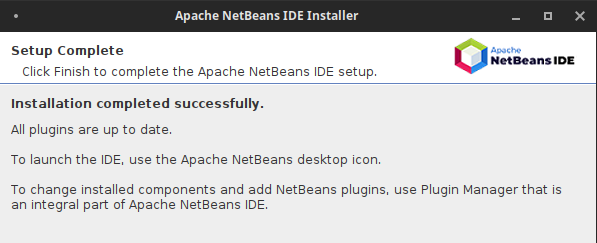

## Instalación de Netbeans 12 <a name=id0></a>

**Nombre:** [Ayoze Hernández Díaz.](https://github.com/ElPayo)

**Curso:** 1º Desarrollo de Aplicaciones Web.

**Asignatura:** Entornos de desarrollo.

### ÍNDICE

+ [Instalación de Netbeans 12](#id0)
+ [Instalación de la versión por defecto](#id1)
+ [Instalación de una versión concreta](#id2)
+ [ANEXO](#ANEX)

### Instalación de la versión más actual <a name=id1></a>

Para instalar netbeans comprobamos que tenemos Java instalado.


Ejecutamos sudo snap install netbeans --classic


Comprobamos que la instalación se ha realizado correctamente.


### Instalación de una versión concreta <a name=id2></a>

Para poder instalar otra versión de netbeans primero se debe eliminar la anterior con **sudo snap remove netbeans**.
Acto seguido debemos de ejecutar el siguiente comando para descargar el Netbeans 12.5:

```wget https://archive.apache.org/dist/netbeans/netbeans/12.5/Apache-NetBeans-12.5-bin-linux-x64.sh```


Vemos que se nos descargó en el directorio en el que estabamos, y le otorgamos permisos de ejecución y ejecutamos.


Después la mayoría de pasos de instalación en el Netbeans son apretar el botón de *Next* o *Siguiente*.


Aquí tenemos que elegir la versión exacta de Java que nosotros queramos, en mi caso la versión 8 de Java.


Comprobamos que la instalación se ha realizado con exito.



----

### ANEXO <a name=ANEXO></a>

+ En mi caso tengo la versión 8 instalada, y para poder comprobar su versión tengo un alias en el fichero **.bashrc** en el que javac es lo mismo que java -version.

+ En la práctica de [JAVA](../tarea1/README.md) el error que surge al mirar la versión es debido a que dependiendo de la versión de java se usa **java -version** o **java --version**, en la versión 8 se usa la primera de las antes mencionadas, mientras que en la 11 se usa la segunda. 