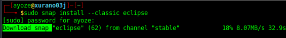
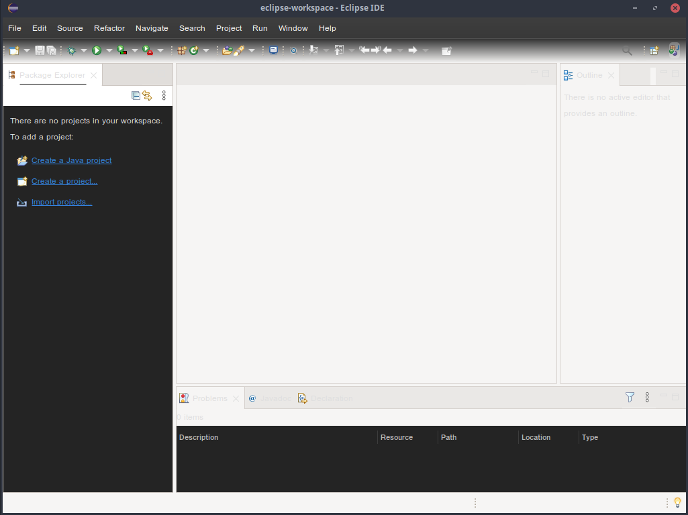

## Instalación de Eclipse <a name=id0></a>

**Nombre:** [Ayoze Hernández Díaz.](https://github.com/ElPayo)

**Curso:** 1º Desarrollo de Aplicaciones Web.

**Asignatura:** Entornos de desarrollo.

### ÍNDICE

+ [Instalación de Eclipse](#id0)
+ [Instalación del IDE Eclipse](#id1)
+ [Configuración del IDE](#id2)

### Instalación del IDE Eclipse <a name=id1></a>

Primeramente debemos de comprobar la versión de Java que está instalada, que es la versión 8 de Java.


Ahora descargamos e instalamos el [IDE Eclipse](https://www.eclipse.org/ide/) con el comando siguiente:

```
sudo snap install --classic eclipse
```



Vemos que se ha descargado con exito.


### Configuración del IDE <a name=id2></a>

Cuando iniciamos por primera vez Eclipse, ya sea por terminal o de manera gráfica, nos pide que elijamos un directorio que actuará como espacio de trabajo.


Una vez elegido el mismo se nos abre la ínterfaz del propio IDE.

