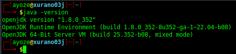
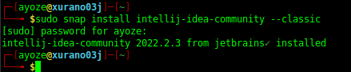
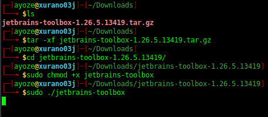
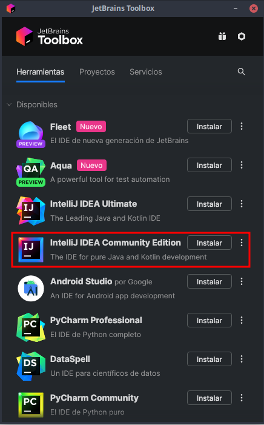
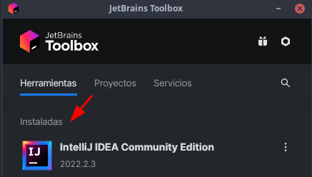

# Instalación de IntelliJ <a name=id0></a>

**Nombre:** [Ayoze Hernández Díaz.](https://github.com/ElPayo)

**Curso:** 1º Desarrollo de Aplicaciones Web.

**Asignatura:** Entornos de desarrollo.

## ÍNDICE

+ [Instalación de IntelliJ](#id0)
+ [](#id1)
+ [](#id2)

###  <a name=id1></a>

Comprobamos primeramente la versión de Java que tengamos en la máquina.



Instalamos IntelliJ mediante snap.

```
sudo snap install intellij-idea-community --classic
```



### Manera alternativa de instalar IntelliJ <a name=id2></a>

Otra manera de instalar IntelliJ sería mediante la aplicación de JetBrains Toolbox.


Descomprimimos el paquete, otorgamos permisos al fichero bash y ejecutamos.



Se abre la siguiente interfaz del Toolbox, dejamos los ajustes de la misma por defecto.


Ahora seleccionamos IntelliJ e instalamos.



Vemos que se instaló.



