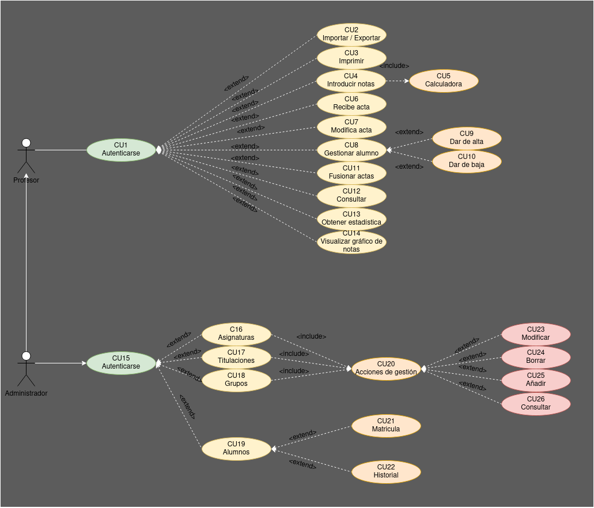

# ETS 

**Nombre:** [Ayoze Hernández Díaz.](https://github.com/ElPayo)

**Curso:** 1º Desarrollo de Aplicaciones Web.

**Asignatura:** Entornos de desarrollo.

## ÍNDICE

+ [ETS](#id0)
+ [Especificaciones de actores](#id1)
  + [Profesores](#id2)
  + [Administradores](#id3)
+ [Casos de uso del profesor](#casos-de-uso-del-profesor)
  + [Autenticarse](#cu1-autenticarse)
  + [Importar/Exportar](#cu2-importarexportar-actas)
  + [Imprimir](#cu3-imprimir)
  + [Introducir notas](#cu4-introducir-notas)
  + [Calculadora](#cu5-calculadora)
  + [Recibe acta](#cu6-recibe-acta)
  + [Modificar acta](#cu7-modificar-acta)
  + [Gestionar alumno](#cu8-gestionar-alumno)
  + [Dar de alta](#cu9-dar-de-alta)
  + [Dar de baja](#cu10-dar-de-baja)
  + [Fusionar actas](#cu11-fusionar-actas)
  + [Consultar](#cu12-consultar)
  + [Obtenere estadísticas](#cu13-obtener-estadística)
  + [Visualizar gráfica](#cu14-visualizar-gráfica)
+ [Casos de uso del](#casos-de-uso-del-administrador)
  + [Autenticarse](#cu15-autenticarse)
  + [Asignaturas](#cu16-asignaturas)
  + [Titulaciones](#cu17-titulaciones)
  + [Grupos](#cu18-grupos)
  + [Alumnos](#cu19-alumnos)
  + [Acciones de gestión](#cu20-acciones-de-gestión)
  + [Matricula](#cu21-matrícula)
  + [Historial](#cu22-historial)
  + [Modificar](#cu23-modificar)
  + [Borrar](#cu24-borrar)
  + [Añadir](#cu25-añadir)
  + [Consultar](#cu26-consultar)

<strong>

 Pulsa para ver el diagrama de casos de usos 

<strong>

## Especificaciones de actores 

### Profesores 

| Actor | Profesor | 
| ----- | ------- | 
| Descripcion | Es un usuario con permisos estándar | 
| Caracteristicas |  | 
| Relaciones |  | 
| Referencias | Usa el CU1 | 
| Notas |  | 
| Autor | _Ayoze Hernández Díaz_ | 
| Fecha | _03/2/2023_ | 

### Administradores 

| Actor | Administrador | 
| ----- | ------- | 
| Descripcion | Es un usuario con permisos superiores en la aplicación  | 
| Caracteristicas |  | 
| Relaciones | Se relaciona con el profesor | 
| Referencias | Usa el CU15 | 
| Notas |  | 
| Autor | _Ayoze Hernández Díaz_ | 
| Fecha | _03/2/2023_ | 

----

## Especificaciones de los casos de uso 

### Casos de uso del profesor 

#### CU1: Autenticarse 

| Caso de Uso: CU1 | Autenticarse |  
|---|---|  
| Fuentes | El caso de uso se sustenta en [este documento](profesores.md) |  
| Actor | Profesor |  
| Descripción | Proceso de autenticación |  
| Flujo básico | El usuario abre la aplicación y se autentica |  
| Pre-condiciones |  |   
| Post-condiciones | |   
| Requerimientos | Estar registrado por administración |  
| Notas | |  
| Autor | _Ayoze Hernández Díaz_ |  
| Fecha | _03/2/2023_ |  

#### CU2: Importar/Exportar actas 

| Caso de Uso: CU2 | Importar/Exportar |
|---|---|  
| Fuentes | El caso de uso se sustenta en [este documento](profesores.md) |  
| Actor | Profesor |
| Descripción | El profesor puede importar o exportar actas de un alumno |  
| Flujo básico | El profesor se autentica e importa/exporta un acta |  
| Pre-condiciones |  |   
| Post-condiciones | |   
| Requerimientos | |  
| Notas | |  
| Autor | _Ayoze Hernández Díaz_ |  
| Fecha | _03/2/2023_ |  

#### CU3: Imprimir 

| Caso de Uso: CU3 | Imprimir |  
|---|---|  
| Fuentes | El caso de uso se sustenta en [este documento](profesores.md) |  
| Actor | Profesor |
| Descripción | Funcionalidad que permite al usuario imprimir actas y listas de calificaciones provisionales  |  
| Flujo básico | El usuario se autentica e imprime |  
| Pre-condiciones | |   
| Post-condiciones | |   
| Requerimientos | |  
| Notas | |  
| Autor | _Ayoze Hernández Díaz_ |  
| Fecha | _03/2/2023_ |  

#### CU4: Introducir notas 

| Caso de Uso: CU4 | Introducir notas |  
|---|---|  
| Fuentes | El caso de uso se sustenta en [este documento](profesores.md) |  
| Actor | Profesor |  
| Descripción | Funcionalidad que le permite al profesor introducir las notas de los alumnos |  
| Flujo básico |  |  
| Pre-condiciones | |   
| Post-condiciones | |   
| Requerimientos | |  
| Notas | |  
| Autor | _Ayoze Hernández Díaz_ |  
| Fecha | _03/2/2023_ |  

#### CU5: Calculadora 

| Caso de Uso: CU5 | Calculadora |  
|---|---|  
| Fuentes | El caso de uso se sustenta en [este documento](profesores.md) |  
| Actor | Profesor |
| Descripción |  |  
| Flujo básico | El usuario se autentica, procede a introducir notas y se abre la calculadora |  
| Pre-condiciones | |   
| Post-condiciones | |   
| Requerimientos | |  
| Notas | |  
| Autor | _Ayoze Hernández Díaz_ |  
| Fecha | _03/2/2023_ |

#### CU6: Recibe acta 

| Caso de Uso: CU6 | Recibe acta |  
|---|---|  
| Fuentes | El caso de uso se sustenta en [este documento](profesores.md) |  
| Actor | Profesor |  
| Descripción | Funcionalidad que permite al usuario recibir actas |
| Flujo básico | El usuario se autentica y puede recibir actas |  
| Pre-condiciones | |   
| Post-condiciones | |
| Requerimientos | |
| Notas | |  
| Autor | _Ayoze Hernández Díaz_ |  
| Fecha | _03/2/2023_ |  

#### CU7: Modificar acta 

| Caso de Uso: CU7 | Modificar acta |  
|---|---|  
| Fuentes | El caso de uso se sustenta en [este documento](profesores.md) |  
| Actor | Profesor |
| Descripción | Funcionalidad que permite modificar actas |  
| Flujo básico | El profesor se autentica y puede modificar el acta |
| Pre-condiciones | |   
| Post-condiciones | |   
| Requerimientos | |  
| Notas | |  
| Autor | _Ayoze Hernández Díaz_ |  
| Fecha | _03/2/2023_ |

#### CU8: Gestionar alumno 

| Caso de Uso: CU8 | Gestionar alumno |
|---|---|  
| Fuentes | El caso de uso se sustenta en [este documento](profesores.md) |  
| Actor | Profesor |
| Descripción | Funcionalidad que le permite al usuario modificar los datos del alumno |  
| Flujo básico | El usuario se autentica y puede modificar los datos del alumno |
| Pre-condiciones | |   
| Post-condiciones | |   
| Requerimientos | |  
| Notas | |  
| Autor | _Ayoze Hernández Díaz_ |  
| Fecha | _03/2/2023_ |

#### CU9: Dar de alta 

| Caso de Uso: CU9 | Dar de alta |  
|---|---|  
| Fuentes | El caso de uso se sustenta en [este documento](profesores.md) |  
| Actor | Profesor |
| Descripción | Funcionalidad que permite dar de alta a un alumno |  
| Flujo básico | El usuario se autentica y accede al caso de uso [Gestionar alumno](#id13) y puede dar de alta un alumno |  
| Pre-condiciones | |   
| Post-condiciones | |   
| Requerimientos | |  
| Notas | |  
| Autor | _Ayoze Hernández Díaz_ |  
| Fecha | _03/2/2023_ |  

#### CU10: Dar de baja 

| Caso de Uso: CU10 | Dar de baja |  
|---|---|  
| Fuentes | El caso de uso se sustenta en [este documento](profesores.md) |  
| Actor | Profesor |
| Descripción | Funcionalidad que permite dar de baja un alumno |
| Flujo básico | El usuario se autentica y accede al caso de uso [Gestionar alumno](#id13) y puede dar de baja un alumno |  
| Pre-condiciones | |   
| Post-condiciones | |   
| Requerimientos | |  
| Notas | |  
| Autor | _Ayoze Hernández Díaz_ |  
| Fecha | _03/2/2023_ |  

#### CU11: Fusionar actas 

| Caso de Uso: CU11 | Fusionar actas |  
|---|---|  
| Fuentes | El caso de uso se sustenta en [este documento](profesores.md) |  
| Actor | Profesor |
| Descripción | Funcionalidad que permite fusionar varias actas de alumnos |
| Flujo básico | El usuario se autentica y puede fusionar actas |  
| Pre-condiciones | |   
| Post-condiciones | |   
| Requerimientos | |  
| Notas | |  
| Autor | _Ayoze Hernández Díaz_ |  
| Fecha | _03/2/2023_ |  

#### CU12: Consultar 

| Caso de Uso: CU12 | Consultar |  
|---|---|  
| Fuentes | El caso de uso se sustenta en [este documento](profesores.md) |  
| Actor | Profesor |
| Descripción | Funcionalidad que permite consultar datos de los alumnos |
| Flujo básico | El usuario se autentica y puede consultar el porcentaje de personas que se han presentado, los que no, datos de los alumnos, las calificaciones de los alumnos |
| Pre-condiciones | |   
| Post-condiciones | |   
| Requerimientos | |  
| Notas | |  
| Autor | _Ayoze Hernández Díaz_ |  
| Fecha | _03/2/2023_ |  

#### CU13: Obtener estadística 

| Caso de Uso: CU13 | Obtener estadística |  
|---|---|  
| Fuentes | El caso de uso se sustenta en [este documento](profesores.md) |  
| Actor | Profesor |
| Descripción | Funcionalidad que permite dar de baja un alumno |
| Flujo básico |  |  
| Pre-condiciones | |   
| Post-condiciones | |   
| Requerimientos | |  
| Notas | |  
| Autor | _Ayoze Hernández Díaz_ |  
| Fecha | _03/2/2023_ |  

#### CU14: Visualizar gráfica 

| Caso de Uso: CU14 | Visualizar gráfica |  
|---|---|  
| Fuentes | El caso de uso se sustenta en [este documento](profesores.md) |  
| Actor | Profesor |
| Descripción | Funcionalidad que permite ver una gráfica que contiene las notas de los alumnos por puntos (0-0.99,1-1.99,2-2.99, etc etc etc) |
| Flujo básico | El usuario se autentica y visualiza una gráfica con las notas de los alumnos |  
| Pre-condiciones | |   
| Post-condiciones | |   
| Requerimientos | |  
| Notas | |  
| Autor | _Ayoze Hernández Díaz_ |  
| Fecha | _03/2/2023_ |  

----

### Casos de uso del administrador 

#### CU15: Autenticarse 

| Caso de Uso: CU15 | Autenticarse |  
|---|---|  
| Fuentes | El caso de uso se sustenta en [este documento](profesores.md) |  
| Actor | Administrador |
| Descripción | Proceso que comprueba la identidad del usuario |
| Flujo básico | El usuario accede al sistema y se autentica |  
| Pre-condiciones | |   
| Post-condiciones | |   
| Requerimientos | Estar dado de alta por el sistema o la administración |  
| Notas | |  
| Autor | _Ayoze Hernández Díaz_ |  
| Fecha | _03/2/2023_ |  

#### CU16: Asignaturas 

| Caso de Uso: CU16 | Asignaturas |  
|---|---|  
| Fuentes | El caso de uso se sustenta en [este documento](profesores.md) |  
| Actor | Administrador |
| Descripción | Categoría sobre la que ejecutar acciones de CRUD (Create Read Update Delete) |
| Flujo básico | El administrador se autentica y selecciona esta categoría |
| Pre-condiciones | |
| Post-condiciones | |   
| Requerimientos | |  
| Notas | |  
| Autor | _Ayoze Hernández Díaz_ |  
| Fecha | _03/2/2023_ |  

#### CU17: Titulaciones 

| Caso de Uso: CU17 | Titulaciones |  
|---|---|  
| Fuentes | El caso de uso se sustenta en [este documento](profesores.md) |  
| Actor | Administrador |
| Descripción | Categoría sobre la que ejecutar acciones de CRUD (Create Read Update Delete) |
| Flujo básico | El administrador se autentica y selecciona esta categoría |  
| Pre-condiciones | |   
| Post-condiciones | |   
| Requerimientos | |  
| Notas | |  
| Autor | _Ayoze Hernández Díaz_ |  
| Fecha | _03/2/2023_ |  

#### CU18: Grupos 

| Caso de Uso: CU18 | Grupos |  
|---|---|  
| Fuentes | El caso de uso se sustenta en [este documento](profesores.md) |  
| Actor | Administrador |
| Descripción | Categoría sobre la que ejecutar acciones de CRUD (Create Read Update Delete) |
| Flujo básico | El administrador se autentica y selecciona esta categoría |  
| Pre-condiciones | |   
| Post-condiciones | |   
| Requerimientos | |  
| Notas | |  
| Autor | _Ayoze Hernández Díaz_ |  
| Fecha | _03/2/2023_ |  

#### CU19: Alumnos 

| Caso de Uso: CU19 | Alumnos |
|---|---|  
| Fuentes | El caso de uso se sustenta en [este documento](profesores.md) |  
| Actor | Administrador |
| Descripción | Categoría sobre la que ejecutar acciones de CRUD (Create Read Update Delete) |
| Flujo básico | El administrador se autentica y selecciona esta categoría |  
| Pre-condiciones | |   
| Post-condiciones | |   
| Requerimientos | |  
| Notas | |  
| Autor | _Ayoze Hernández Díaz_ |  
| Fecha | _03/2/2023_ |  

#### CU20: Acciones de gestión 

| Caso de Uso: CU20 | Acciones de gestión |
|---|---|  
| Fuentes | El caso de uso se sustenta en [este documento](profesores.md) |  
| Actor | Administrador |
| Descripción | Funcionalidad que engloba el CRUD (Create Read Update Delete) |
| Flujo básico | El administrador se autentica, selecciona una de las categorías (grupos, titulaciones, asignaturas) y procede a ejecutar una de las acciones del CRUD |  
| Pre-condiciones | |   
| Post-condiciones | |   
| Requerimientos | |  
| Notas | |  
| Autor | _Ayoze Hernández Díaz_ |  
| Fecha | _03/2/2023_ |  

#### CU21: Matrícula 

| Caso de Uso: CU21 | Matrícula |  
|---|---|  
| Fuentes | El caso de uso se sustenta en [este documento](profesores.md) |  
| Actor | Administrador |
| Descripción | Funcionalidad que permite al administrador consultar la matricula del alumno |
| Flujo básico | El administrador se autentica, selecciona el alumno y realiza consultas sobre la matricula en caso de que esté matriculado, o porqué no se pudo matricular en caso de que no lo esté |  
| Pre-condiciones | |   
| Post-condiciones | |   
| Requerimientos | |  
| Notas | |  
| Autor | _Ayoze Hernández Díaz_ |  
| Fecha | _03/2/2023_ |  

#### CU22: Historial 

| Caso de Uso: CU22 | Historial |  
|---|---|  
| Fuentes | El caso de uso se sustenta en [este documento](profesores.md) |  
| Actor | Administrador |
| Descripción | Funcionalidad que permite al administrador consultar el historial académico del alumno |
| Flujo básico | El administrador se autentica, selecciona el alumno y realiza consultas sobre su historial |  
| Pre-condiciones | |   
| Post-condiciones | |   
| Requerimientos | |  
| Notas | |  
| Autor | _Ayoze Hernández Díaz_ |  
| Fecha | _03/2/2023_ |  

#### CU23: Modificar 

| Caso de Uso: CU23 | Modificar |  
|---|---|  
| Fuentes | El caso de uso se sustenta en [este documento](profesores.md) |  
| Actor | Administrador |
| Descripción | Funcionalidad que permite al administrador modificar datos de los grupos, titulaciones o de las asignaturas |
| Flujo básico | El usuario se autentica, selecciona una categoría (asignaturas, titulaciones o grupos) y procede a modificar datos a la misma |  
| Pre-condiciones | |   
| Post-condiciones | |   
| Requerimientos | |  
| Notas | |  
| Autor | _Ayoze Hernández Díaz_ |  
| Fecha | _03/2/2023_ |  

#### CU24: Borrar 

| Caso de Uso: CU24 | Borrar |  
|---|---|  
| Fuentes | El caso de uso se sustenta en [este documento](profesores.md) |  
| Actor | Administrador |
| Descripción | Funcionalidad que permite al administrador borrar datos de los grupos, titulaciones o de las asignaturas |
| Flujo básico | El usuario se autentica, selecciona una categoría (asignaturas, titulaciones o grupos) y procede a borrar datos a la misma |
| Pre-condiciones | |   
| Post-condiciones | |   
| Requerimientos | |  
| Notas | |  
| Autor | _Ayoze Hernández Díaz_ |  
| Fecha | _03/2/2023_ |  

#### CU25: Añadir 

| Caso de Uso: CU25 | Añadir |
|---|---|  
| Fuentes | El caso de uso se sustenta en [este documento](profesores.md) |  
| Actor | Administrador |
| Descripción | Funcionalidad que permite al administrador añadir a los grupos, titulaciones o a las asignaturas |
| Flujo básico | El usuario se autentica, selecciona una categoría (asignaturas, titulaciones o grupos) y procede a añadir datos a la misma |  
| Pre-condiciones | |   
| Post-condiciones | |   
| Requerimientos | |  
| Notas | |  
| Autor | _Ayoze Hernández Díaz_ |  
| Fecha | _03/2/2023_ |  

#### CU26: Consultar 

| Caso de Uso: CU26 | Consultar |  
|---|---|  
| Fuentes | El caso de uso se sustenta en [este documento](profesores.md) |  
| Actor | Administrador |
| Descripción | Funcionalidad que permite al administrador consultar datos sobre los grupos, titulaciones o asignaturas |
| Flujo básico | El usuario se autentica, selecciona una categoría (asignaturas, titulaciones o grupos) y procede a realizar consultas sobre la misma |
| Pre-condiciones | |   
| Post-condiciones | |   
| Requerimientos | |  
| Notas | |  
| Autor | _Ayoze Hernández Díaz_ |  
| Fecha | _03/2/2023_ |  
