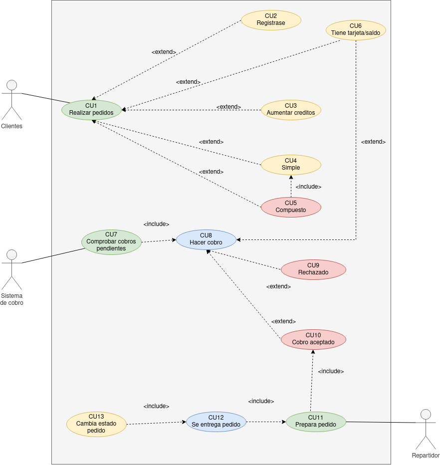

# ETS 

**Nombre:** [Ayoze Hernández Díaz.](https://github.com/ElPayo)

**Curso:** 1º Desarrollo de Aplicaciones Web.

**Asignatura:** Entornos de desarrollo.

## ÍNDICE

+ [ETS](#id0)
+ [Especificaciones de actores](#id1)
  + [Cliente](#id2)
  + [Sistema de cobro](#id3)
  + [Repartidor](#id4)
+ [Especificaciones de los casos de uso](#id5)
  + [Realizar pedidos](#id6)
  + [Registrase](#id7)
  + [Aumentar créditos](#id8)
  + [Pedido simple](#id9)
  + [Pedido compuesto](#id10)
  + [Tiene tarjeta/saldo](#id11)
  + [Comprobar cobros pendientes](#id12)
  + [Hacer cobro](#id13)
  + [Cobro rechazado](#id14)
  + [Cobro aceptado](#id15)
  + [Prepara pedido](#id16)
  + [Se entrega pedido](#id17)
  + [Cambio estado pedido](#id18)
 
----
<strong>

 Pulsa para ver el diagrama de casos de usos 

<strong>

----

## Especificaciones de actores 

### Cliente 

 | Actor | Cliente | 
 | ----- | ------- | 
 | Descripcion | Es un cliente que interactua con la app de la tienda | 
 | Caracteristicas | Ninguna en especial | 
 | Relaciones | No se relaciona con nadie | 
 | Referencias | Usa el cu 1 | 
 | Notas |  | 
 | Autor | _Ayoze Hernández Díaz_ | 
 | Fecha | _25/1/2023_ | 

### Sistema de cobro 

 | Actor | Sistema de cobro | 
 | ----- | ------- | 
 | Descripcion |  Sistema que realiza cobros a la tarjeta del cliente  | 
 | Caracteristicas |  Ninguna en especial  | 
 | Relaciones | No se relaciona con nadie   |  
  |  Referencias  |  Usa el cu 7   |  
  |  Notas  |    |  
  |  Autor  |  _Ayoze Hernández Díaz_  |  
  |  Fecha  |  _25/1/2023_  |  

### Repartidor 

  |  Actor  |  Repartidor  |  
  |  -----  |  -------  |  
  |  Descripcion  |  Encargado de hacer que el pedido llegue al cliente  |  
  |  Caracteristicas  |  Ninguna en especial  |  
  |  Relaciones  |  No se relaciona con nadie  |  
  |  Referencias  |  Usa el cu 11  |  
  |  Notas  |    |  
  |  Autor  |  _Ayoze Hernández Díaz_  |  
  |  Fecha  |  _25/1/2023_  |  

----

## Especificaciones de los casos de uso 

### Realizar pedidos 

  |   Caso de Uso	CU.1   |   Realizar pedidos   |  
  |  ---  |  ---  |  
  |   Fuentes   |   El caso de uso se sustenta en [este documento](tienda_virtual.md)   |  
  |   Actor   |   Clientes   |  
  |   Descripción   |   El cliente realiza un pedido en la aplicación   |  
  |   Flujo básico   |   El cliente ordena un pedido para que le sea entregado   |  
  |   Pre-condiciones   |     |   
  |   Post-condiciones   |     |   
  |   Requerimientos   |     |  
  |   Notas   |     |  
  |   Autor   |   _Ayoze Hernández Díaz_   |  
  |  Fecha   |   _25/1/2023_   |  

### Registrase 

  |   Caso de Uso	CU.2   |   Registrarse   |  
  |  ---  |  ---  |  
  |   Fuentes   |   El caso de uso se sustenta en [este documento](tienda_virtual.md)   |  
  |   Actor   |   Clientes   |  
  |   Descripción   |   El cliente que realiza un pedido pero no está registrado se registra   |  
  |   Flujo básico   |   El cliente ordena un pedido pero para ello se tiene que registrar primero   |  
  |   Pre-condiciones   |   No tener cuenta en la app   |   
  |   Post-condiciones   |     |   
  |   Requerimientos   |   Se debe realizar el CU1(Realizar un pedido cualquiera)   |  
  |   Notas   |     |  
  |   Autor   |   _Ayoze Hernández Díaz_   |  
  |  Fecha   |   _25/1/2023_   |  

### Aumentar créditos 

  |   Caso de Uso	CU.3   |   Aumentar créditos   |  
  |  ---  |  ---  |  
  |   Fuentes   |   El caso de uso se sustenta en [este documento](tienda_virtual.md)   |  
  |   Actor   |   Clientes   |  
  |   Descripción   |   El cliente aumenta los créditos/saldo de la tarjeta   |  
  |   Flujo básico   |   El cliente aumenta los creditos de su cuenta para realizar pedidos   |  
  |   Pre-condiciones   |     |   
  |   Post-condiciones   |     |   
  |   Requerimientos   |   Se debe realizar el CU1(Realizar un pedido cualquiera)   |  
  |   Notas   |     |  
  |   Autor   |   _Ayoze Hernández Díaz_   |  
  |  Fecha   |   _25/1/2023_   |  

### Pedido simple 

  |   Caso de Uso	CU.4   |   Pedido Simple   |  
  |  ---  |  ---  |  
  |   Fuentes   |   El caso de uso se sustenta en [este documento](tienda_virtual.md)   |  
  |   Actor   |   Clientes   |  
  |   Descripción   |   El cliente realiza un pedido simple (menos de 20 objetos)   |  
  |   Flujo básico   |   El cliente realiza un pedido   |  
  |   Pre-condiciones   |     |   
  |   Post-condiciones   |     |   
  |   Requerimientos   |   Se debe realizar el CU1(Realizar un pedido cualquiera)   |  
  |   Notas   |     |  
  |   Autor   |   _Ayoze Hernández Díaz_   |  
  |  Fecha   |   _25/1/2023_   |  

### Pedido compuesto 

  |   Caso de Uso	CU.5   |   Pedido Compuesto   |  
  |  ---  |  ---  |  
  |   Fuentes   |   El caso de uso se sustenta en [este documento](tienda_virtual.md)   |  
  |   Actor   |   Clientes   |  
  |   Descripción   |   El cliente realiza un pedido compuesto (más de 20 objetos)   |  
  |   Flujo básico   |   El cliente realiza un pedido grande   |  
  |   Pre-condiciones   |     |   
  |   Post-condiciones   |     |   
  |   Requerimientos   |   Se debe realizar el CU4(Se realiza un pedido simple de más de 20 objetos)   |  
  |   Notas   |     |  
  |   Autor   |   _Ayoze Hernández Díaz_   |  
  |  Fecha   |   _25/1/2023_   |  

### Tiene tarjeta/saldo 

  |   Caso de Uso	CU.6   |   Tiene tarjeta o saldo   |  
  |  ---  |  ---  |  
  |   Fuentes   |   El caso de uso se sustenta en [este documento](tienda_virtual.md)   |  
  |   Actor   |   Clientes y Sistema de cobro   |  
  |   Descripción   |   Es donde el cliente tiene su dinero, ya sea una tarjeta que haya vinculado al registrarse o el saldo de la propia cuenta   |  
  |   Flujo básico   |   El cliente se registra y vincula su tarjeta al hacer su primer pedido  |  
  |   Pre-condiciones   |     |   
  |   Post-condiciones   |     |   
  |   Requerimientos   |   Se debe realizar el CU1   |  
  |   Notas   |     |  
  |   Autor   |   _Ayoze Hernández Díaz_   |  
  |  Fecha   |   _25/1/2023_   |  

### Comprobar cobros pendientes 

  |   Caso de Uso	CU.7   |   Comprobar cobros pendientes   |  
  |  ---  |  ---  |  
  |   Fuentes   |   El caso de uso se sustenta en [este documento](tienda_virtual.md)   |  
  |   Actor   |   Sistema de cobro   |  
  |   Descripción   |   Todos los cobros pendientes se realizarán a las 23:59 de cada día   |  
  |   Flujo básico   |   El sistema de cobro mira los pedidos que el cliente ha realizado y los cobra a las 23:59   |  
  |   Pre-condiciones   |   Que el cliente haya realizado un pedido   |   
  |   Post-condiciones   |     |   
  |   Requerimientos   |     |  
  |   Notas   |     |  
  |   Autor   |   _Ayoze Hernández Díaz_   |  
  |  Fecha   |   _25/1/2023_   |  

### Hacer cobro 

  |   Caso de Uso CU.8   |   Hacer cobro   |  
  |  ---  |  ---  |  
  |   Fuentes   |   El caso de uso se sustenta en [este documento](tienda_virtual.md)   |  
  |   Actor   |   Sistema de cobro   |  
  |   Descripción   |   Se efectua el cobro   |  
  |   Flujo básico   |   Se comprueban y efectuan los cobros pendientes   |  
  |   Pre-condiciones   |   Que hayan cobros pendientes y haya saldo   |   
  |   Post-condiciones   |     |   
  |   Requerimientos   |   Se debe realizar el CU7   |  
  |   Notas   |     |  
  |   Autor   |   _Ayoze Hernández Díaz_   |  
  |  Fecha   |   _25/1/2023_   |  

### Cobro rechazado 

  |   Caso de Uso CU.9   |   Cobro rechazado   |  
  |  ---  |  ---  |  
  |   Fuentes   |   El caso de uso se sustenta en [este documento](tienda_virtual.md)   |  
  |   Actor   |   Sistema de cobro   |  
  |   Descripción   |   El cobro es rechazado porque no hay fondos suficientes   |  
  |   Flujo básico   |   Se comprueban los cobros pendientes y se rechaza por falta de fondos   |  
  |   Pre-condiciones   |   Hacer cobro   |   
  |   Post-condiciones   |     |   
  |   Requerimientos   |   Se debe realizar el CU8   |  
  |   Notas   |     |  
  |   Autor   |   _Ayoze Hernández Díaz_   |  
  |  Fecha   |   _25/1/2023_   |  

### Cobro aceptado 

  |   Caso de Uso CU.10   |   Cobro aceptado   |  
  |  ---  |  ---  |  
  |   Fuentes   |   El caso de uso se sustenta en [este documento](tienda_virtual.md)   |  
  |   Actor   |   Repartidor y sistema de cobro   |  
  |   Descripción   |   El cobro pendiente es aceptado   |  
  |   Flujo básico   |   Cuando se comprueban los cobros pendientes se efectua el pago con exito   |  
  |   Pre-condiciones   |     |   
  |   Post-condiciones   |     |   
  |   Requerimientos   |   Se debe realizar el CU8   |  
  |   Notas   |     |  
  |   Autor   |   _Ayoze Hernández Díaz_   |  
  |  Fecha   |   _25/1/2023_   |  

### Prepara pedido 

  |   Caso de Uso CU.11   |   Prepara pedido   |  
  |  ---  |  ---  |  
  |   Fuentes   |   El caso de uso se sustenta en [este documento](tienda_virtual.md)   |  
  |   Actor   |   Repartidor   |  
  |   Descripción   |   Se prepara el pedido del cliente   |  
  |   Flujo básico   |   Cuando el pago se efectua se inicia la preparación del pedido   |  
  |   Pre-condiciones   |   Que el pago se acepte   |   
  |   Post-condiciones   |     |   
  |   Requerimientos   |   Se debe realizar el CU10   |  
  |   Notas   |     |  
  |   Autor   |   _Ayoze Hernández Díaz_   |  
  |  Fecha   |   _25/1/2023_   |  

### Se entrega pedido 

  |   Caso de Uso	CU.12   |   Se entrega pedido   |  
  |  ---  |  ---  |  
  |   Fuentes   |   El caso de uso se sustenta en [este documento](tienda_virtual.md)   |  
  |   Actor   |   Repartidor   |  
  |   Descripción   |   El repartidor entrega el pedido   |  
  |   Flujo básico   |   El repartidor prepara y entrega el pedido   |  
  |   Pre-condiciones   |   El pedido debe estar preparado   |   
  |   Post-condiciones   |     |   
  |   Requerimientos   |   Se debe realizar el CU11   |  
  |   Notas   |     |  
  |   Autor   |   _Ayoze Hernández Díaz_   |  
  |  Fecha   |   _25/1/2023_   |  

### Cambia estado pedido 

  |   Caso de Uso CU.13   |   Cambia estado pedido   |  
  |  ---  |  ---  |  
  |   Fuentes   |   El caso de uso se sustenta en [este documento](tienda_virtual.md)   |  
  |   Actor   |   Repartidor   |  
  |   Descripción   |   El pedido cambia su estado de **no entregado** a **entregado**   |  
  |   Flujo básico   |   El pedido se entrega al cliente y cambia su estado   |  
  |   Pre-condiciones   |   El pedido debe haber sido preparado y entregado   |   
  |   Post-condiciones   |     |   
  |   Requerimientos   |   Se debe realizar el CU12   |  
  |   Notas   |     |  
  |   Autor   |   _Ayoze Hernández Díaz_   |  
  |  Fecha   |   _25/1/2023_   |  